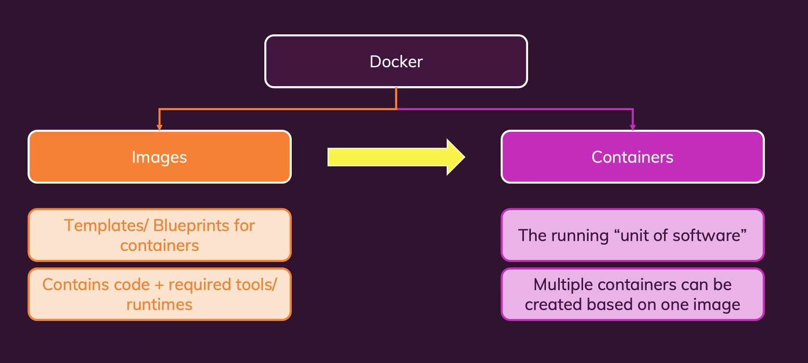
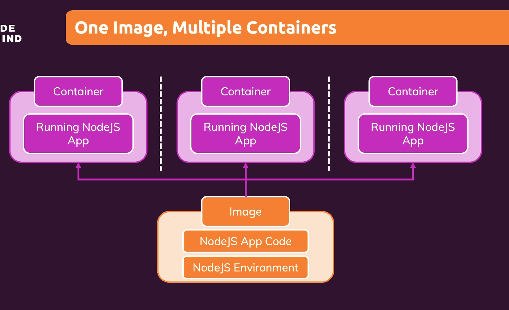
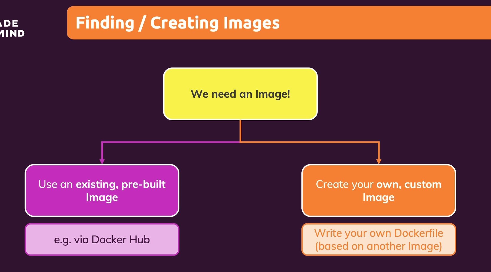
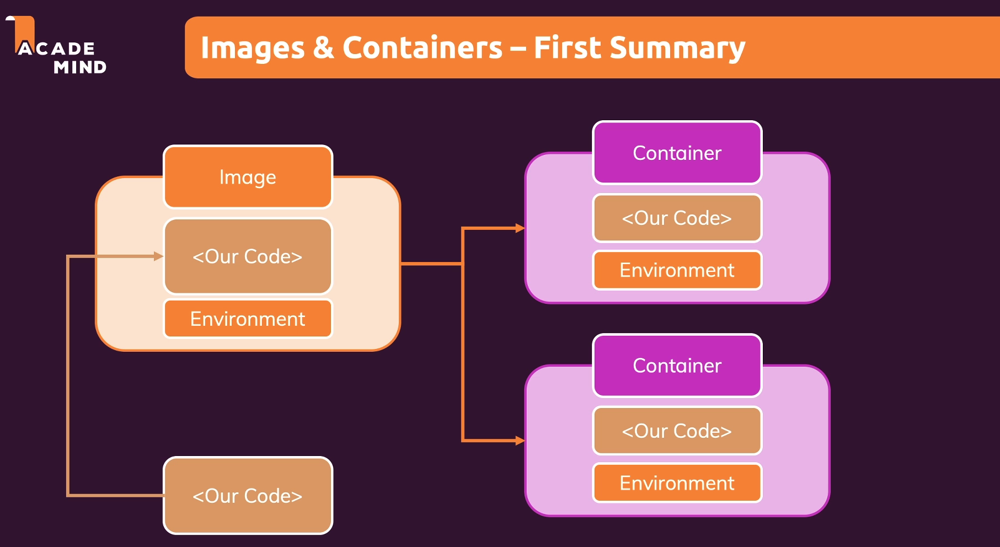
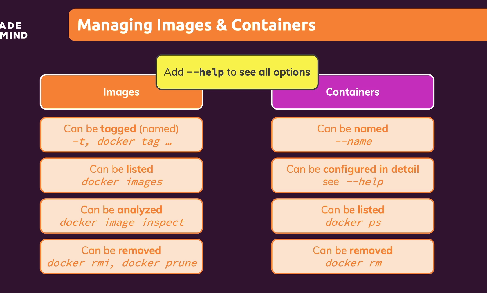
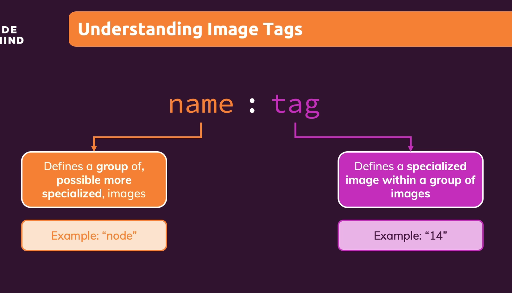
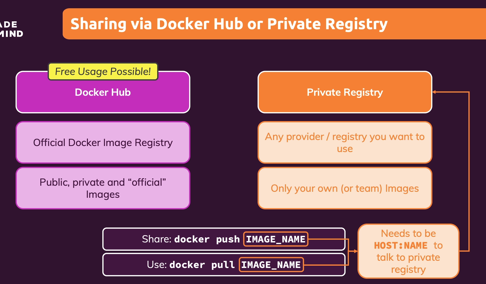
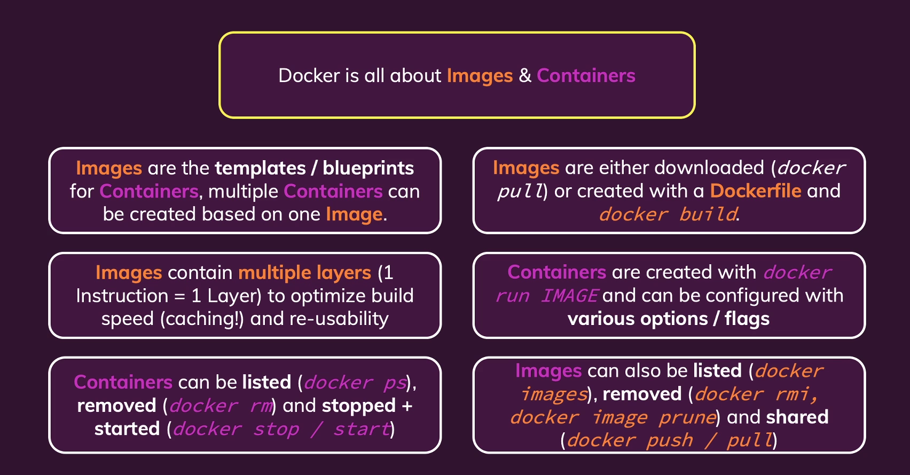

# Docker

Docker File for Creating Image

```
FROM node:14

WORKDIR /app

COPY package.json .

RUN npm install

COPY . .

EXPOSE 3000

CMD [ "node", "app.mjs" ]
```

Build the image using Dockerfile

```
docker build .
```

Run the build image , p is for publish the port

```
docker run -p [Localhost Port]:[Container Port] [Image id]
docker run -p 3000:3000 [Image id]
```

Listing all running containers

```
docker ps
```

Stopping the running container

```
docker stop [container id/container name]
```

### Module-1 Images and Containers

Image: Templates/ Blueprints for containers (like class in oops)
Container: The running "unit of software" or instance of images (like multiple object of one class)



Using Images
for using node

```
docker run node
```

To get all containers

```
docker ps -a
```

Run container In Interactive mode

```
docker run -it node
```



Create our own Image using Dockerfile

```
FROM node:14

WORKDIR /app

COPY package.json .

RUN npm install

//copy Local to workdir on Image file system
//same as
//COPY . /app

COPY . .

EXPOSE 3000

CMD [ "node", "app.mjs" ]
```

```
FROM node:14

WORKDIR /app

COPY package.json /app

RUN npm install

COPY . /app

EXPOSE 80

CMD ["node", "server.js"]
```

To Build the image

```
docker build .
```

To run image with published port

```
docker run -p [Localhost port]:[Image exposed port] [Image-Id/Image name]
docker run -p 3000:80 221d41782901922b0     //3000 is local port
```

Note: rebuild the image again if you want to make any changes in source code

start a stopped container

```
docker start [container Id]
```



Managing Images and container



for help

```
docker --help
docker [command] --help
docker ps --help
```

List of running container

```
docker ps
```

List of all container running as well as stopped

```
docker ps -a
```

Restart a stopped container

```
docker start [container Id]
```

Attached and detached container
Default for running Image using run is in attached mode
Default for starting stopped container is in detached mode

Attached mode is used for printing something in console
Note: attach is only for listening into console not for taking inputs from console

Detach mode

```
docker run -p [Localhost port]:[Image exposed port] -d [Image-Id/Image name]
```

attach a container

```
docker attach [container Id]
```

start stopped container in attach mode

```
docker start -a [container id]
```

Getting logs of container

```
docker logs [container Id]
```

getting future logs with past logs in attached mode

```
docker logs -f [container Id/name]
```

Interactive Mode for taking inputs from console
Dockerfile for Python

```
FROM python

WORKDIR /app

COPY . /app

CMD [ "python", "app.py" ]
```

running container in interactive mode
-i for interactive mode even it is detached
-t for pseudo terminal exposed by container

```
docker run -it [Image Id/name]
```

restart stopped container in attached and interactive mode
-i for interactive
-a for attached only for listening (printing)

```
docker start -a -i [Container Id]
```

Remove the stopped container, running container can not be removed

```
docker rm [Container Id]
docker rm [Container Id1] [Container Id2]
```

Remove the container after exiting from it or removing stopped container automatically

```
docker run -it  --rm [Image Id]
```

Manage Images
List all images

```
docker images
```

Remove images
you can remove images only after container with that images must be removed (both running and stopped)

```
docker rmi [Image Id]
docker rmi [Image Id1] [Image Id2]
```

Remove all unused images

```
docker image prune
```

Inspect image

```
docker image inspect [Image Id]
```

Copying file into and from running container
copy from local to container

```
docker cp [Local source path] [Container id/name] :/[destination folder path]
docker cp dummy_source_folder/.  container_name:/destination_folder
```

copy from container to local

```
docker cp [container Id/name]:/destinationinsidecontainer_path Local_path
```

Naming the container

```
docker run -p 3000:80 -d --rm --name [container name eg. myapp] [image_id]
```

for stopping container using container name

```
docker stop [container name]
```

Tag for image similar as name for container
name:tag (tag is optional, similar as version node:14)

```
docker build -t [name]:[tag] .
docker build -t myapp:latest .
```

run container using image name and tag

```
docker run -p 3000:80 -d --rm --name [container name eg. myapp] [imagename]:[tag]
```



Sharing Images and container


login into docker once (username,password)

```
docker login
```

Logout

```
docker logout
```

push local image to docker hub

```
docker build -t [docker hub user name]/[image name] .
docker push [docker hub user name]/[image name]

docker build -t academind/[image name] .
docker push academind/[image name]
```

rename or adding tag to existing build image (clone of old image)

```
docker tag [old image name]:[old tag] [new image name]:[new tag]
```

Pull image from docker hub can be done even logout for public image

```
docker pull [username]/[image name]
```

run pulled image

```
docker run [username]/[image name]
```



### Module-2 Managing data and working with Volumes
